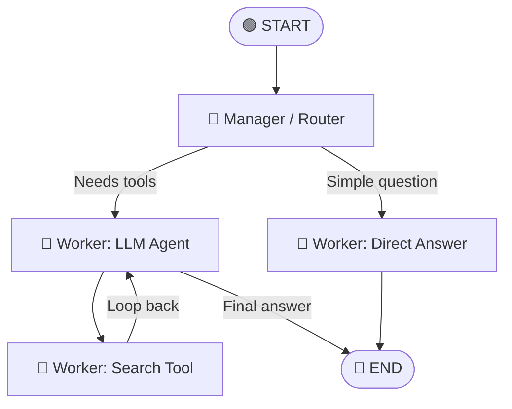
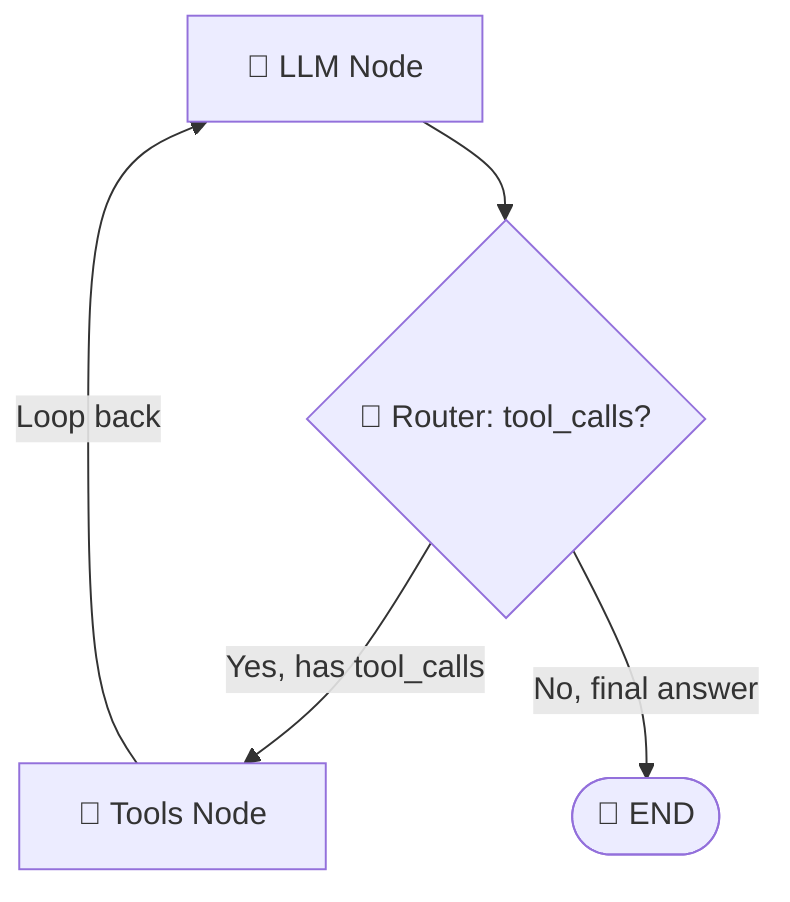
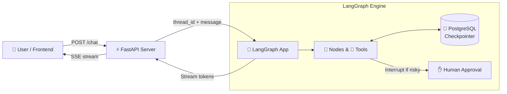
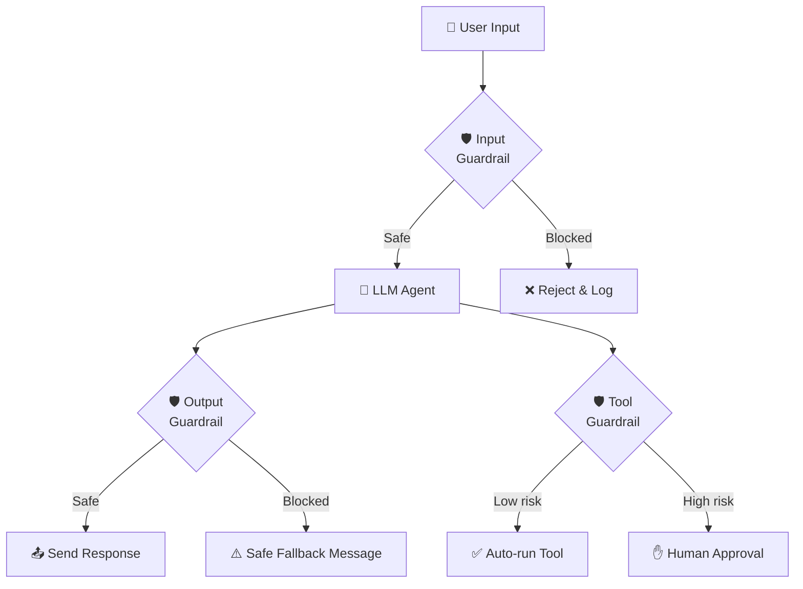

# 🚀 LangGraph Ultimate Cheatsheet (Zero to Production)

LangGraph helps you build **smart AI agents that remember things, make decisions, use tools, and correct their own mistakes**.

If a normal AI prompt is a single text message, LangGraph is a **whole team of workers passing a clipboard back and forth**.

---

## 📑 Table of Contents

1. [The 3 Core Concepts](#-the-3-core-concepts)
2. [Step 0: Setup & Installation](#-step-0-setup--installation)
3. [The 6 Steps to Build a LangGraph](#️-the-6-steps-to-build-a-langgraph)
4. [Full Copy-Paste Runnable Example](#-full-copy-paste-runnable-example)
5. [FastAPI Production Integration](#-fastapi-production-integration)
6. [Security & Guardrails](#️-security--guardrails)
7. [Debugging Cheatsheet](#-debugging-cheatsheet)
8. [Project Folder Structure](#-project-folder-structure)
9. [Quick Reference Table](#-quick-reference-table)

---

## 🧠 The 3 Core Concepts

| # | Concept | What It Is | Analogy |
|---|---------|------------|---------|
| 1 | **State** | A dictionary that holds ALL data flowing through the graph | 📋 A **shared clipboard** all team members read and write to |
| 2 | **Nodes** | Python functions that do work (call LLM, search DB, run tools) | 👷 **Workers** who pick up the clipboard, do a task, and update it |
| 3 | **Edges** | Logic that decides which Node runs next | 🚦 A **manager** who looks at the clipboard and assigns the next worker |



---

## 📦 Step 0: Setup & Installation

### 1. Create Your Project

```bash
# Create a project folder
mkdir my_langgraph_app
cd my_langgraph_app

# Create and activate a virtual environment
python -m venv .venv

# Windows:
.venv\Scripts\activate

# Mac/Linux:
source .venv/bin/activate
```

### 2. Install Packages

```bash
# Core packages (REQUIRED)
pip install langgraph langchain-core python-dotenv

# Pick ONE LLM provider:
pip install langchain-groq        # For Groq (free, fast)
pip install langchain-openai      # For OpenAI / OpenRouter
pip install langchain-google-genai # For Google Gemini

# Tools (OPTIONAL, for search/web tools)
pip install langchain-tavily      # Tavily web search

# Production (OPTIONAL, for FastAPI server)
pip install fastapi uvicorn
```

### 3. Create Your `.env` File
Create a file called `.env` in your project root:

```env
# Pick the one(s) you need:
GROQ_API_KEY=gsk_your_groq_key_here
OPENAI_API_KEY=sk-your_openai_key_here
TAVILY_API_KEY=tvly-your_tavily_key_here
```

> [!IMPORTANT]
> **Never commit your `.env` file to GitHub!** Add `.env` to your `.gitignore` file.

### 4. Connect to Your LLM

```python
import os
from dotenv import load_dotenv

# Load API keys from .env file
load_dotenv()

# Option A: Groq (free tier available)
from langchain_groq import ChatGroq
llm = ChatGroq(model="openai/gpt-oss-120b")

# Option B: OpenAI
# from langchain_openai import ChatOpenAI
# llm = ChatOpenAI(model="gpt-4o-mini")

# Test it!
response = llm.invoke("Say hello in one word")
print(response.content)  # Should print something like "Hello!"
```

---

## 🛠️ The 6 Steps to Build a LangGraph

### Step 1: Define the State (The Clipboard 📋)

The State is a Python class that defines **what data flows through your graph**. Every node reads from it and writes back to it.

**Two options:**

```python
# ──────────────────────────────────────────────
# Option A: MessagesState (for chatbots - easiest)
# ──────────────────────────────────────────────
from langgraph.graph import MessagesState

# MessagesState already has: messages: list[AnyMessage]
# You can extend it with extra fields:
class MyState(MessagesState):
    user_name: str
    documents_found: list[str]

# ──────────────────────────────────────────────
# Option B: Custom TypedDict (for non-chat apps)
# ──────────────────────────────────────────────
from typing import TypedDict, Annotated
from langgraph.graph.message import add_messages

class MyState(TypedDict):
    messages: Annotated[list, add_messages]  # auto-appends messages
    application: str
    experience_level: str
    response: str
```

> [!TIP]
> **When to use which?**
> - Building a chatbot or tool-calling agent → Use `MessagesState`
> - Building a pipeline (like your candidate screening app) → Use custom `TypedDict`

---

### Step 2: Create Nodes (The Workers 👷)

Nodes are **just normal Python functions**. They take `state` as input and return a dictionary of **only the keys they want to update**.

```python
# A node that calls the LLM
def chatbot_node(state: MyState):
    # 1. Read from state (the clipboard)
    history = state["messages"]

    # 2. Do work (call LLM)
    response = llm.invoke(history)

    # 3. Return ONLY what you want to update
    return {"messages": [response]}

# A node that does something simple (no LLM needed!)
def greeting_node(state: MyState):
    return {"response": f"Welcome, {state['user_name']}!"}
```

> [!NOTE]
> **Key rule:** A node does NOT need to return every key in the state. Only return the keys you want to change. LangGraph merges them automatically.

---

### Step 3: Create Tools & Bind Them to the LLM (🔧)

Tools let the LLM **call external services** (search engines, databases, APIs). You create tools as Python functions with docstrings, then **bind** them to the LLM.

```python
from langchain_tavily import TavilySearch

# Pre-built tool
search_tool = TavilySearch(max_results=2)

# Custom tool (just a function with a good docstring!)
def multiply(a: int, b: int) -> int:
    """Multiply two numbers together.

    Args:
        a: First number
        b: Second number

    Returns:
        The product of a and b
    """
    return a * b

# Bind tools to LLM (so the LLM knows what tools exist)
tools = [search_tool, multiply]
llm_with_tools = llm.bind_tools(tools)
```

> [!IMPORTANT]
> **The docstring is crucial!** The LLM reads it to decide WHEN and HOW to use the tool. Bad docstring = bad tool usage.

---

### Step 4: Create Routers (The Decision Makers 🚦)

A router is a function that looks at the state and returns **the name of the next node** as a string. LangGraph calls this a **conditional edge**.

```python
def route_after_llm(state: MyState) -> str:
    """Decide what to do after the LLM responds."""
    last_message = state["messages"][-1]

    # If the LLM wants to use a tool, go to the tools node
    if last_message.tool_calls:
        return "tools"

    # Otherwise, we're done
    return "END"
```



---

### Step 5: Build the Graph (Wiring It Up 🔌)

Now connect everything together. This is where most beginners make mistakes — pay attention to the names!

```python
from langgraph.graph import StateGraph, START, END
from langgraph.prebuilt import ToolNode

# 1. Initialize the graph with your State
builder = StateGraph(MyState)

# 2. Add Nodes (Workers)
builder.add_node("chatbot", chatbot_node)
builder.add_node("tools", ToolNode(tools))  # Pre-built node that runs tools

# 3. Add Edges (Wiring)
builder.add_edge(START, "chatbot")           # Entry point

builder.add_conditional_edges(
    "chatbot",                                # FROM this node
    route_after_llm,                          # Run this router function
    {                                         # Map return values to nodes
        "tools": "tools",                     #   "tools" → go to tools node
        "END": END                            #   "END"   → finish
    }
)

builder.add_edge("tools", "chatbot")         # After tools, loop back to LLM
```

> [!WARNING]
> **Common Bug:** If you forget the 3rd argument (the dictionary map) in `add_conditional_edges`, your mermaid diagram will be broken AND the routing may silently fail!

---

### Step 6: Compile & Run (🚀)

```python
# For Development (in-memory, lost on restart):
from langgraph.checkpoint.memory import MemorySaver
memory = MemorySaver()

# For Production (saves to database):
# pip install langgraph-checkpoint-sqlite
# from langgraph.checkpoint.sqlite import SqliteSaver
# import sqlite3
# conn = sqlite3.connect("checkpoints.sqlite", check_same_thread=False)
# memory = SqliteSaver(conn)

# Compile!
app = builder.compile(checkpointer=memory)

# Run it with a thread_id (each user gets their own memory)
config = {"configurable": {"thread_id": "user_123"}}

result = app.invoke(
    {"messages": [("user", "What is 5 * 12?")]},
    config
)

print(result["messages"][-1].content)
```

---

## 📋 Full Copy-Paste Runnable Example

Save this as `main.py` and run it with `python main.py`:

```python
"""
LangGraph Chatbot - Complete Working Example
Run: python main.py
"""
import os
from dotenv import load_dotenv
from langchain_groq import ChatGroq
from langgraph.graph import StateGraph, MessagesState, START, END
from langgraph.checkpoint.memory import MemorySaver

# ── Step 0: Setup ────────────────────────────────────────
load_dotenv()
llm = ChatGroq(model="openai/gpt-oss-120b")

# ── Step 1: State (using built-in MessagesState) ────────
# MessagesState already has: messages: Annotated[list, add_messages]

# ── Step 2: Node ─────────────────────────────────────────
def chatbot(state: MessagesState):
    """The worker: calls the LLM and returns its response."""
    return {"messages": [llm.invoke(state["messages"])]}

# ── Step 3-5: Build Graph ────────────────────────────────
builder = StateGraph(MessagesState)
builder.add_node("chatbot", chatbot)
builder.add_edge(START, "chatbot")
builder.add_edge("chatbot", END)

# ── Step 6: Compile with memory ──────────────────────────
memory = MemorySaver()
app = builder.compile(checkpointer=memory)

# ── Run: Interactive Chat Loop ───────────────────────────
def main():
    config = {"configurable": {"thread_id": "demo_session"}}
    print("🤖 LangGraph Chatbot (type 'quit' to exit)\n")

    while True:
        user_input = input("You: ").strip()
        if user_input.lower() in ("quit", "exit", "q"):
            print("Bye! 👋")
            break

        result = app.invoke(
            {"messages": [("user", user_input)]},
            config
        )
        print(f"Bot: {result['messages'][-1].content}\n")

if __name__ == "__main__":
    main()
```

> [!TIP]
> **Test memory is working:** Tell the bot your name in message 1, then ask "What's my name?" in message 2. It should remember because they share the same `thread_id`!

---

## 🌐 FastAPI Production Integration

In production, your LangGraph runs as a **backend API** that a website or mobile app calls over HTTP.



### Complete FastAPI Server (`server.py`)

```python
"""
LangGraph + FastAPI Production Server
Run: uvicorn server:fastapi_app --reload
"""
import os
from dotenv import load_dotenv
from fastapi import FastAPI, HTTPException
from fastapi.responses import StreamingResponse
from fastapi.middleware.cors import CORSMiddleware
from pydantic import BaseModel
from langchain_groq import ChatGroq
from langgraph.graph import StateGraph, MessagesState, START, END
from langgraph.checkpoint.memory import MemorySaver

# ── Setup ────────────────────────────────────────────────
load_dotenv()
llm = ChatGroq(model="openai/gpt-oss-120b")

# ── Build Graph ──────────────────────────────────────────
def chatbot(state: MessagesState):
    return {"messages": [llm.invoke(state["messages"])]}

builder = StateGraph(MessagesState)
builder.add_node("chatbot", chatbot)
builder.add_edge(START, "chatbot")
builder.add_edge("chatbot", END)

memory = MemorySaver()  # Use PostgresSaver in real production!
graph_app = builder.compile(checkpointer=memory)

# ── FastAPI App ──────────────────────────────────────────
fastapi_app = FastAPI(title="LangGraph Chat API")

# Allow frontend to call the API (CORS)
fastapi_app.add_middleware(
    CORSMiddleware,
    allow_origins=["*"],         # Lock this down in production!
    allow_methods=["*"],
    allow_headers=["*"],
)

class ChatRequest(BaseModel):
    user_id: str
    message: str

class ChatResponse(BaseModel):
    reply: str
    thread_id: str

# ── Simple Endpoint (returns full response) ──────────────
@fastapi_app.post("/chat", response_model=ChatResponse)
async def chat(req: ChatRequest):
    config = {"configurable": {"thread_id": req.user_id}}

    result = graph_app.invoke(
        {"messages": [("user", req.message)]},
        config
    )

    return ChatResponse(
        reply=result["messages"][-1].content,
        thread_id=req.user_id,
    )

# ── Streaming Endpoint (tokens arrive as they generate) ──
@fastapi_app.post("/chat/stream")
async def chat_stream(req: ChatRequest):
    config = {"configurable": {"thread_id": req.user_id}}

    async def event_generator():
        async for event in graph_app.astream_events(
            {"messages": [("user", req.message)]},
            config=config,
            version="v2",
        ):
            if event["event"] == "on_chat_model_stream":
                token = event["data"]["chunk"].content
                if token:
                    yield f"data: {token}\n\n"
        yield "data: [DONE]\n\n"

    return StreamingResponse(
        event_generator(),
        media_type="text/event-stream",
    )

# ── Health Check ─────────────────────────────────────────
@fastapi_app.get("/health")
async def health():
    return {"status": "ok"}
```

### How to Run It

```bash
# Start the server
uvicorn server:fastapi_app --reload --port 8000

# Test with curl
curl -X POST http://localhost:8000/chat \
  -H "Content-Type: application/json" \
  -d '{"user_id": "user_1", "message": "Hello!"}'
```

### Quick Streamlit Frontend (`ui.py`)
Freshers often struggle to build a frontend. Use **Streamlit** to get a UI instantly!
```bash
pip install streamlit requests
```
```python
import streamlit as st
import requests

st.title("🤖 LangGraph Agent")

if "user_id" not in st.session_state:
    st.session_state.user_id = "user_123"

message = st.text_input("Message:")
if st.button("Send") and message:
    with st.spinner("Thinking..."):
        # Call your FastAPI backend
        response = requests.post(
            "http://localhost:8000/chat", 
            json={"user_id": st.session_state.user_id, "message": message}
        )
        st.write("Bot:", response.json()["reply"])
```
Run it with: `streamlit run ui.py`

---

## 🛡️ Security & Guardrails

When you move to production, your AI agent can be **abused, jailbroken, or make expensive mistakes**. Here's how to protect it.



### 1. Input Guardrails (Block Bad Prompts)

```python
# Add this as the FIRST node in your graph
BLOCKED_PATTERNS = [
    "ignore previous instructions",
    "ignore all rules",
    "you are now",
    "pretend you are",
    "act as an unrestricted",
]

def input_guardrail(state: MessagesState):
    """Block prompt injection and jailbreak attempts."""
    user_msg = state["messages"][-1].content.lower()

    for pattern in BLOCKED_PATTERNS:
        if pattern in user_msg:
            return {
                "messages": [
                    {"role": "assistant",
                     "content": "I can't process that request. Please rephrase."}
                ]
            }

    return state  # Safe — pass through unchanged

# Wire it as the first node:
builder.add_edge(START, "input_guardrail")
builder.add_edge("input_guardrail", "chatbot")
```

### 2. Output Guardrails (Filter Dangerous Responses)

```python
SENSITIVE_KEYWORDS = ["password", "credit card", "ssn", "social security"]

def output_guardrail(state: MessagesState):
    """Catch if the LLM accidentally leaks sensitive info."""
    ai_msg = state["messages"][-1].content.lower()

    for keyword in SENSITIVE_KEYWORDS:
        if keyword in ai_msg:
            return {
                "messages": [
                    {"role": "assistant",
                     "content": "I detected sensitive information in my response. "
                                "For your safety, I've redacted it."}
                ]
            }
    return state  # Safe
```

### 3. Human-in-the-Loop (Pause Before Dangerous Actions)

```python
# Compile with interrupt — graph PAUSES before running this node
app = builder.compile(
    checkpointer=memory,
    interrupt_before=["send_email_node", "delete_database_node"]
)

# Graph runs until it hits "send_email_node", then STOPS.
result = app.invoke(input_data, config)

# A human reviews the state, then resumes:
app.invoke(None, config)  # None = "continue from where you paused"
```

### 4. Rate Limiting (Prevent Abuse)

```python
from fastapi import Request
from collections import defaultdict
import time

# Simple in-memory rate limiter
request_counts: dict[str, list[float]] = defaultdict(list)

MAX_REQUESTS_PER_MINUTE = 10

@fastapi_app.middleware("http")
async def rate_limit(request: Request, call_next):
    client_ip = request.client.host
    now = time.time()

    # Clean old entries
    request_counts[client_ip] = [
        t for t in request_counts[client_ip] if now - t < 60
    ]

    if len(request_counts[client_ip]) >= MAX_REQUESTS_PER_MINUTE:
        raise HTTPException(status_code=429, detail="Too many requests")

    request_counts[client_ip].append(now)
    return await call_next(request)
```

### 5. Cost Control (Don't Go Bankrupt)

```python
MAX_TOOL_CALLS_PER_TURN = 5

def route_after_llm(state: MessagesState) -> str:
    """Router with a safety limit on tool call loops."""
    # Count how many tool calls happened in this conversation turn
    tool_call_count = sum(
        1 for msg in state["messages"]
        if hasattr(msg, "tool_calls") and msg.tool_calls
    )

    if tool_call_count >= MAX_TOOL_CALLS_PER_TURN:
        return "END"  # Force stop to prevent infinite loop

    last_message = state["messages"][-1]
    if hasattr(last_message, "tool_calls") and last_message.tool_calls:
        return "tools"

    return "END"
```

---

## 🐛 Debugging Cheatsheet

| Problem | Cause | Fix |
|---------|-------|-----|
| `Found edge starting at unknown node 'X'` | Typo in node name. You registered `"reject_aplication"` but added edge for `"reject_application"` | Make all node name strings **exactly match** everywhere |
| Mermaid diagram missing arrows | Missing the 3rd argument (dictionary map) in `add_conditional_edges()` | Always pass `{"return_value": "node_name"}` as the 3rd argument |
| `RuntimeError` on `add_node` | Only passed the name string, forgot the function | `add_node("name", function)` needs **both** arguments |
| Router always goes to `else` branch | LLM returns `"**Senior-level**"` but you check `== "senior-level"` | Use `.lower()` and `"keyword" in value` instead of `==` exact match |
| `ModuleNotFoundError` | Wrong Python environment / kernel | Make sure your notebook kernel is set to `.venv` not global Python |
| Memory not working across turns | Missing `checkpointer` or different `thread_id` | Pass same `config = {"configurable": {"thread_id": "..."}}` every call |
| Infinite loop (agent keeps calling tools) | No exit condition in router | Add a `MAX_TOOL_CALLS` counter (see Cost Control above) |

### Visualize Your Graph (Always Do This!)

```python
from IPython.display import Image, display

# In Jupyter Notebook:
display(Image(app.get_graph().draw_mermaid_png()))

# Or print the raw mermaid text to paste into mermaid.live:
print(app.get_graph().draw_mermaid())
```

---

## 🚀 Deployment (Getting it on the Internet)

When your app is ready, how do you share it with the world?

1. **Backend (FastAPI + LangGraph):** 
   - Write a `Dockerfile` for your app.
   - Host it on services like **Render**, **Railway**, or **Heroku**. They will run your `uvicorn` server 24/7.
2. **Database (Memory):**
   - Attach a managed PostgreSQL database to your Render/Railway app.
   - Use `langgraph-checkpoint-postgres` instead of `MemorySaver` so memory persists even if the server restarts.
3. **Frontend (Streamlit / Vercel):**
   - Host your Streamlit UI on **Streamlit Community Cloud** (free) or deploy a Next.js frontend on **Vercel** (free).

---

## 📁 Project Folder Structure

For a big, clean, production-ready LangGraph app:

```text
my_langgraph_app/
├── .env                 # API keys (NEVER commit this!)
├── .gitignore           # Add .env and .venv here
├── pyproject.toml       # Dependencies
├── requirements.txt     # pip freeze output
│
├── app/
│   ├── __init__.py
│   ├── state.py         # 📋 State definitions (TypedDict / MessagesState)
│   ├── nodes.py         # 👷 Worker functions (LLM calls, DB queries)
│   ├── routers.py       # 🚦 Decision functions (conditional routing)
│   ├── tools.py         # 🔧 Tool definitions (search, multiply, etc.)
│   ├── guardrails.py    # 🛡️ Input/output safety checks
│   ├── graph.py         # 🔌 StateGraph assembly & compile()
│   └── server.py        # 🌐 FastAPI endpoints
│
├── tests/
│   ├── test_nodes.py
│   └── test_graph.py
│
└── README.md
```

---

## 📊 Quick Reference Table

| What You Want To Do | Code |
|---------------------|------|
| Create a graph | `builder = StateGraph(MyState)` |
| Add a worker node | `builder.add_node("name", function)` |
| Set the entry point | `builder.add_edge(START, "first_node")` |
| Connect two nodes | `builder.add_edge("node_a", "node_b")` |
| Add a decision/router | `builder.add_conditional_edges("from_node", router_fn, {"value": "target"})` |
| End the graph | `builder.add_edge("last_node", END)` |
| Compile the graph | `app = builder.compile()` |
| Add memory | `app = builder.compile(checkpointer=MemorySaver())` |
| Pause for human | `app = builder.compile(interrupt_before=["risky_node"])` |
| Run the graph | `app.invoke({"messages": [...]}, config)` |
| Resume after pause | `app.invoke(None, config)` |
| Stream tokens | `async for event in app.astream_events(input, config, version="v2")` |
| Visualize | `Image(app.get_graph().draw_mermaid_png())` |
| Bind tools to LLM | `llm_with_tools = llm.bind_tools([tool1, tool2])` |
